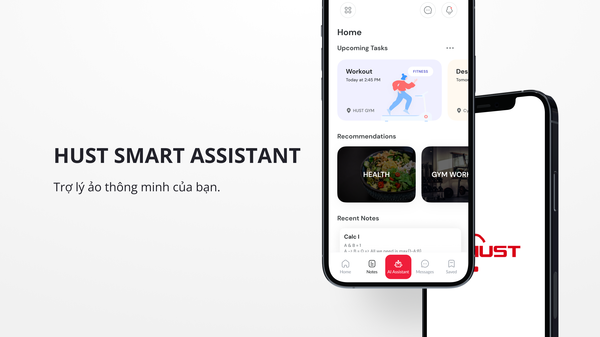

<h1 align="center">
  <br>
  <a href="#"></a>
  <br>
  HUST Smart Assistant
  <br>
</h1>

<h4 align="center">A smart assistant for students built on top of <a href="https://reactnative.dev/" target="_blank">React Native</a>.</h4>

<p align="center">
  <a href="#key-features">Key Features</a> •
  <a href="#how-to-use">How To Use</a> •
  <a href="#download">Download</a> •
  <a href="#credits">Credits</a> •
  <a href="#related">Related</a> •
  <a href="#license">License</a>
</p>



## Key Features

* Auto Functions
  - With this feature, users can assign simple tasks to virtual assistants. Then, the virtual assistant will automatically handle those tasks for the user before the specified deadline
* Organize tasks accroding to P.A.R.A structure
  - When users record their upcoming tasks, the virtual assistant will automatically distribute the user's tasks into sections according to the P.A.R.A structure.
* Recommendations:
  - By using users' personal data, the assistant can provide useful recommendations for users.
  - Exercises recommendations: Providing user with manys work out that can be filtered to fit with user
  - Diet recommendation: Check health of user according meal, workout frequency and give strategy and healthy recipes for user  
* Virtual assistant: 
  - The created feature acts as an effective assistant for users with the ability to give accurate answers and perform assigned tasks.
* Cross platform supported!
* Ability to collect data and summarize a document according to the topic user require
* Context search on video and summarize 😎

## Future Features
- [ ] Update picture for each workout in exercise recommendation
- [ ] Provide suitable workout plans according to user data linked with healthy recipes provided (Make by using AI model)
- [ ] Dark mode 
- [ ] Imporve scalability
- [ ] Comple authentication (as current version only use to demo in hackathon so authentication haven't been completed yet)
- [ ] Deploy to CH Play if there are many users want to experience this app 

## How To Use

To clone and run this application, you'll need [Git](https://git-scm.com) and [Node.js](https://nodejs.org/en/download/) (which comes with [npm](http://npmjs.com)) installed on your computer. From your command line:

```bash
# Clone this repository
$ git clone https://github.com/or2er/HUST-Smart-Ass-Frontend-TS.git

# Install dependencies
$ npm install

# Run the app
$ npm start
```

> **Note**
> If you're using Linux Bash for Windows, [see this guide](https://www.howtogeek.com/261575/how-to-run-graphical-linux-desktop-applications-from-windows-10s-bash-shell/) or use `node` from the command prompt.


## Emailware

Markdownify is an [emailware](https://en.wiktionary.org/wiki/emailware). Meaning, if you liked using this app or it has helped you in any way, I'd like you send me an email at <maivannhatminh2005@gmail.com> about anything you'd want to say about this software. I'd really appreciate it!

## Credits

This software uses the following open source packages:

- [React Native](https://reactnative.dev/)
- [Node.js](https://nodejs.org/)
- [React Native Paper](https://reactnativepaper.com/)

<!-- ## Support

<a href="https://www.buymeacoffee.com/5Zn8Xh3l9" target="_blank"></a>

<p>Or</p> 

<a href="https://www.patreon.com/amitmerchant">
	
</a> -->
<!-- 
## You may also like...

- [Pomolectron](https://github.com/amitmerchant1990/pomolectron) - A pomodoro app
- [Correo](https://github.com/amitmerchant1990/correo) - A menubar/taskbar Gmail App for Windows and macOS -->

## Authors

- Đỗ Minh Nhật - Frontend Dev + AI Engineer ([@nhatdm22022537](https://github.com/nhatdm22022537))
- Khổng Ngọc Anh - Backend Dev + AI Engineer ([@kanawanttotimetravel](https://github.com/kanawanttotimetravel))
- Phạm Nhật Quang - Backend Dev ([@Legend0fHell](https://github.com/Legend0fHell))
- Nguyễn Quang Ninh - AI Engineer ([@qninhdt](https://github.com/qninhdt))
- Mai Văn Nhật Minh - Frontend Dev + UI/UX Designer ([@Supporter09](https://github.com/Supporter09))

---


> GitHub [@Supporter09](https://github.com/Supporter09) &nbsp;&middot;&nbsp;
<!-- > Twitter [@amit_merchant](https://twitter.com/amit_merchant) -->

